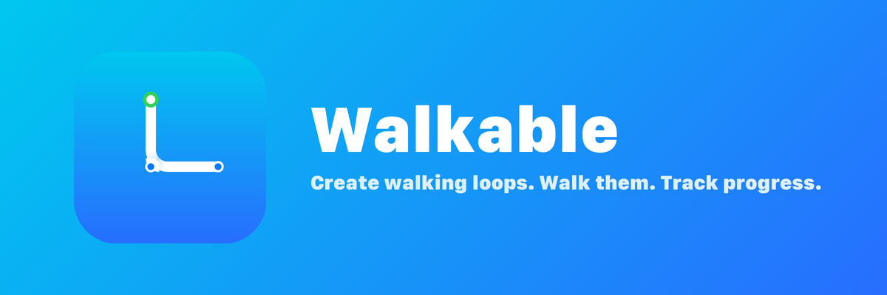
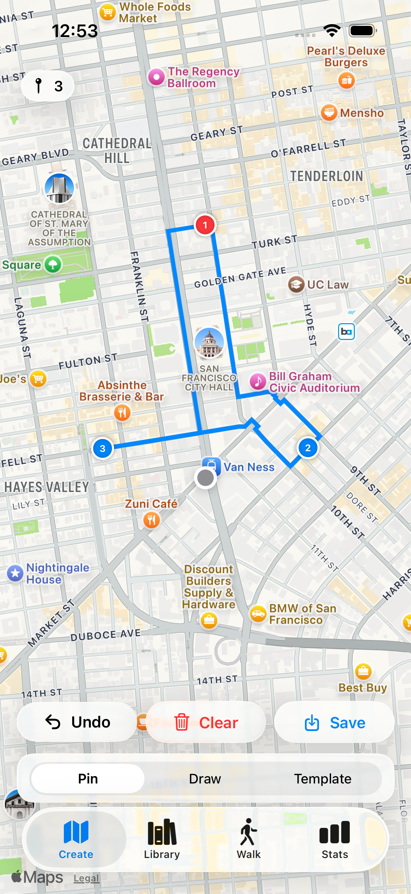

<p align="center">
  
</p>

<p align="center">
  <strong>A native iOS + watchOS app for creating and walking custom loops around your neighborhood.</strong><br>
  Built entirely with Apple frameworks, zero external dependencies.
</p>

<p align="center">
  
  
  
  
</p>

<p align="center">
  
</p>

## Features

### Create Walking Loops

Three ways to design your route:

- **Pin Mode** - Tap the map to place waypoints. The app calculates a walkable route between them using Apple Maps directions, automatically closing the loop.
- **Draw Mode** - Freehand draw a loop on the map. The app snaps your drawing to walkable roads and generates waypoints along the path.
- **Templates** - Pick a shape (Loop, Out & Back, Figure-8), set a target distance, and generate a route from your current location.

Routes snap to walkable roads via MKDirections. Waypoints can be edited after placement (long-press to move or delete).

### Walk with Live Guidance

- Real-time GPS tracking with walked (gray) vs remaining (blue) polyline
- Two camera modes: top-down overview and GPS follow (tilted 3D, heading-aligned)
- Haptic feedback at each waypoint arrival
- Dynamic Island and Lock Screen Live Activity showing distance, time, and pace
- Walk banner appears on other tabs when a walk is in progress

### Apple Watch (Standalone)

- Create routes directly on the Watch by placing pins on a map
- Walk synced routes from iPhone or locally-created ones
- Three swipeable views during a walk: Route Map, Compass (arrow to next waypoint), Now Playing
- Walk results sync back to iPhone automatically
- Phone-to-Watch handoff: start a walk on iPhone, Watch takes over

### Stats & Health

- Walking workouts saved to Apple Health (works on both iPhone and Watch)
- Weekly/monthly dashboard with distance, walks, pace trends, streaks
- Per-route leaderboard with best times
- Per-waypoint leg splits
- Deletable sessions (removes from both app and HealthKit)

### Library

- Save, search, tag, and favorite your routes
- Sort by date, distance, times walked, or nearest
- Route detail view with map preview and stats
- Swipe to favorite or delete

## Tech Stack

| Component | Technology |
|-----------|-----------|
| UI | SwiftUI + Liquid Glass (iOS 26) |
| Maps | MapKit (MKDirections, MapPolyline) |
| Persistence | SwiftData |
| Health | HealthKit (HKWorkoutSession, HKWorkoutBuilder) |
| Watch Sync | WatchConnectivity |
| Live Activity | ActivityKit + WidgetKit |
| Location | CoreLocation |
| Project Gen | XcodeGen |

**Zero external dependencies.** Everything is built on Apple frameworks.

## Requirements

- iOS 26.0+ / watchOS 26.0+
- Xcode 26.3+
- XcodeGen (`brew install xcodegen`)

## Getting Started

```bash
# Clone
git clone https://github.com/samoht9277/walkable.git
cd walkable

# Generate Xcode project
make generate

# Build
make build

# Run tests
make test-all

# Open in Xcode (for device deployment)
make open
```

To install on your phone: open in Xcode, select your team in Signing & Capabilities for both `WalkableApp` and `WalkableWatch` targets, then Cmd+R.

## Project Structure

```
Walkable/
  WalkableKit/          Shared Swift package (models, services, formatters)
  WalkableApp/          iOS app (views, view models, haptics)
  WalkableWatch/        watchOS app (standalone route creation + walking)
  WalkableWidgets/      Dynamic Island + Lock Screen Live Activity
  WalkableTests/        48 unit tests
  WalkableUITests/      17 UI automation tests
  project.yml           XcodeGen project definition
```

## Testing

```bash
make test        # 48 unit tests (models, routing, path simplifier, templates, formatters)
make test-ui     # 17 UI tests (tab navigation, create modes, library, stats)
make test-all    # Everything
```

## License

This project is licensed under the [GNU General Public License v3.0](LICENSE).
